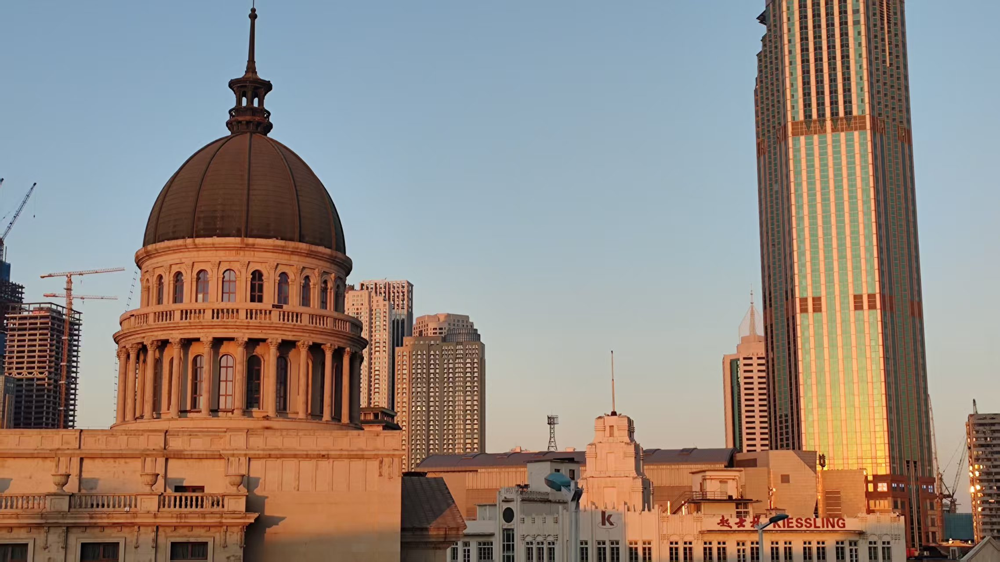
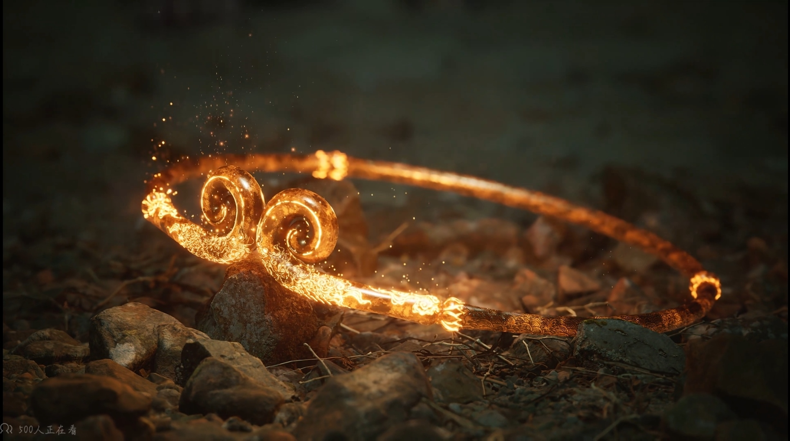
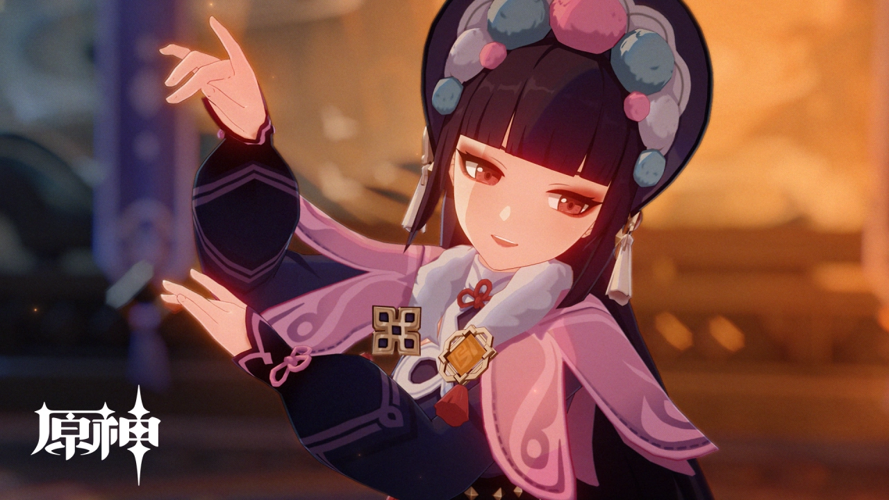
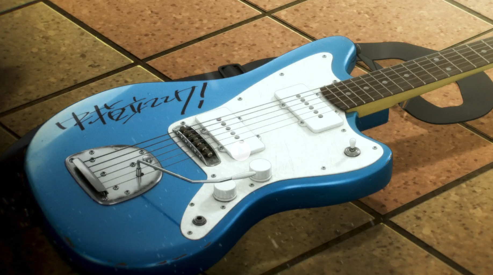

<iframe frameborder="no" border="0" marginwidth="0" marginheight="0" width=330 height=86 src="//music.163.com/outchain/player?type=2&id=2145269432&auto=0&height=66"></iframe>

## 说在前面

虽然一直以来从未做过诸如此类总结，但不知怎的，临近年末，我的心态发生了一些细微的转变，或许是进入了中二期？又或者只是单纯的回归了自己本来的样子，我无从得知。不过，2024悄然流过，它又给我们**留下了什么**？

回首这短短的366天，当我以如今的心态审视过去的我，又是另一番滋味。还没来得及细细品味此时此刻，时光便迫不及待地将你拉进下一段故事，唯有在片刻的安宁中，才能从囫囵吞枣的麻木中寻得一丝波澜。

因此，与其说是年度总结，不如说是**对这一年中人与事的回味**，看看在日复一日的忙碌中，自己究竟**遇到了什么，得到了什么**，也顺便抒发一下对未来的展望罢。姑且就视作是当下心中复杂的情感在经过贫瘠的语言翻译过后的结果吧（

<!-- more -->

---

## 走廊惊魂

~~这是什么鬼名字啊喂~~

回想起来，这应该是整个高一印象最深刻的一件事了（

每当在初三的生活中痛苦地挣扎时，谁又能相信两年后的自己会对那一段时期如此怀念？

但我们珍视的**绝不仅仅**是那一段奋斗的经历，而是**与朋友一同度过**的时光。

站在2025伊始回望比2024更久远的2023，埋头书山的场景逐渐模糊，而在每个课间消遣的情景却依旧历历在目

——不论是空调外机下的假宝玉，还是1km模拟的一次误解，还是体育课上生死时速的重装系统，网线转接头到货时的激动不已，偷带相机团伙作案时的悠哉快哉，抑或是打排球时的菜鸡互啄，中午没人抬饭而不得不抬到食堂，中午吃完饭的~~小西红柿~~小零食......

（说到这里，以后或许还要给"四人帮"写个专题）

一个个灿烂的瞬间依旧活在我脑海中，而那日复一日的**忙碌**却只是为那几个**瞬间**铺下了一层**底色**，从不争辉，从不起眼，但每当我们回忆起过去的时候，却又会不自觉地进入到这个“**过去的Docker**”中，仿佛一个沙箱，将一块块回忆隔离，赋予他们应有的环境。

说了这么多，“走廊惊魂”这个题目却也显得有些多余了，对2024的回忆也侵入了2023的净土。总之，我想说的是

> 真正会永久储存在回忆中的，不会是低饱和度的底色，而永远是那稀少而又璀璨的，片刻安宁。

---

## 关于黑神话

暑假+黑神话发布=......

= nothing

没错，鉴于暑假作业的压力及财政短缺（喂），我对黑神话的体验反而是来自一场场直播中——虽然这也并不罕见，毕竟对**游戏主旨**的把控也并不强制要求亲身体验。

>《黑神话：悟空》，在我心里，无疑是当之无愧的**国产之光**，是继《流浪地球2》之后，又一个**价值观输出**的旷世神作

我认为，**价值观**输出属于**文化**输出，但高于文化输出。

每当人们提起《球2》时，即使其中并无“文化输出”**刻板印象**中的所谓“丝绸朋克”，“中式美学”（此处为狭义），却也让人第一反应就是“这是中国的作品”，**为什么？**

> “50岁以上的，出列！”
>
> “岂曰无衣，与子同袍！”

答案也很简单——**集体主义**的精神，并不是哪个地区都有的，耳濡目染的**社会主义核心价值观**，更不是随便哪个民族能贯彻的。

不知是中华民族自古多灾多难还是华夏儿女天性本善，集体主义似乎从出生起就**牢牢地刻印在每个人**的骨子里。但随着互联网时代的到来，炫彩夺目的西方极乐却也在悄无声息地**侵蚀**着民族根基，中华文化的精髓似乎被视为了人人唾弃的东西.

不论是影视作品还是游戏小说，最能称得上“文化输出”的似乎**只是**国粹京剧的出场或是古风建筑的列锦，而真正核心的**民族精神**却总是缺席。

当然，燕赵多慷慨悲歌之辈，我中华也不乏**弘毅**之士。不论是**郭帆**的流浪地球异军突起，还是**冯骥**的黑神话不负众望，他们的作品中总是不乏集体主义的闪耀与理想主义的光辉，处处体现着对不公和压迫的反抗。

我总是在想，文化输出究竟是什么？《原神》的璃月是不是文化输出？《神女劈观》算不算文化输出？当然算，甚至可以说是同类作品中极为优秀的案例，但若只是撇去文化宝库上的一层浮沫，就不可能达到真正的**美美与共**。

但，所幸中国的创作者们的挖掘从未停止，文化输出的内涵也逐渐深刻，从“古风”到“国潮”再到如今的“丝绸朋克”，“共和国风”之辈，每一次的创新不论好坏，都是对中华文化的进一步挖掘与碰撞。

总有一天，**价值输出**将会取代文化输出的地位，占领世界文化的主舞台，总有一日，中华文明将会回到祂应有的位置，与棋盘翻覆中坐观沧海桑田。

就用《未竟》的一句歌词结尾吧

>试问有谁，再打破顽空。
>
>不堕轮回万古传。

---

## 高斯

我不清楚我究竟是何时**认识**的他，又是何时**丢失**了他。

似乎在小学我就认识了他，但如何认识的，何时认识的却一直是个谜。在我印象中，他应当是个有主见，有想法，敢做敢当，敢于创新的人。在初中阶段，他一度是我与父母交谈时的榜样，甚至最后还有幸考入了同一所高中。

但人，或者说**环境**，总是会变的。

也许是高中的囚笼并**不适合**雄鹰的高飞，或是巢中的雏鸟**惧怕**高考时的万丈深渊，抑或是早就受够了寒风刺骨的老鸟**放弃**了对所谓“未来”的渴望，他**退学**了。

自那以后，我与他**断联**了很长时间，依稀记得重新联系上还是在fs的帮助下，他转到了一所游戏开发学校，对于有理想的人来说，能在专业的地方追求自己喜爱的事物，并不是一件坏事，但不久之后，他再次退学了。

这次是因为麻雀聚集的地方虽有佳肴，但真正的鸿鹄怎会甘于埋没于叽叽喳喳的颓废中。他在家**自学**C++，我虽不擅指针种种，却也多少能看懂逻辑，他的敢想敢做早就超越了我，缺乏的也只是一点经验而已。

在一次凌晨的交谈中，他又像是受了什么打击，自那以后，我们再次断联了。这也正常，毕竟16 17岁的少年，怎会在受尽挫折后仍能笑面他人的安稳平和？

以上的一切也仅仅是我**一厢情愿的揣摩**，至于他**真正经历**的挫折与压力，我更**没有资格**去假设，也没有脸面去评判他的选择。若有哪句话存在不妥之处，我也只能在这里道一声**抱歉**。

但不论如何

> 只愿你历尽千帆，归来仍是**少年**。

---

## 分班

最初，我对分班并没有多少“感觉”，兴许是本就与那些即将离开的同学们并不熟悉——能叫的上名字的都没几个；也或许是对即将到来的新人并不期待——毕竟和老同学也没什么交流 (lll￢ω￢)

> 但毋庸置疑，分班的确让我认识了值得认识也应当认识的人，下文就称之为**东姐姐**了（

实际上早在分班前的暑假我和东姐姐就已初识，当时是去参加一个天大导师的讲座，说是让我们有机会和大学学长们参与项目（虽说后续也烂尾了）。
由于我俩都到的太早就莫名其妙加上了微信¯\\\_(ツ)_/¯

之所以要单为东姐开个专题，兴许是因为从行为习惯，到喜好，~~甚至是想要性转的想法~~——我从未在他人身上看到如此多的相似之处。

不论怎么说，这次分班都是一次新鲜血液的注入，也是重整状态的一次契机。

---

## 生日

8月26日的生日似乎天生就和开学犯冲，悲喜交加的感觉更是难以言说。

但这次提到生日，却不是因为开学，与其说是写生日，不如说是写**父亲**。

在我印象中，尤其是**小学孩童**时的重重阴影，爹似乎是一个**严厉，冲动，暴躁，保守**的人（不过站在现在的视角会看小学时做的缺德事儿，我要是他我也骂（不是）（喂））

但他**并非**如此。高中的学业压力足以让我精疲力竭，再提不起精力控制自己的情绪——但上班远比上学**累**。仅仅从日常给老师剪辑视频，制作ppt，整理数据的煎熬，我就能窥见几分未来就业后的痛苦人生（雾）

那天是个雨天，雨说大不大，但在夏装的情况下，很冷。风雨兼程来到饭店，他却在菜肴刚刚上齐后就被单位叫走**加班**。他在餐桌上本就话不多，对于这顿饭来讲，无非只是剩饭剩菜多了一些，但过度疲劳的后果总是在不知不觉间酝酿。

那天，他凌晨才到家，紧跟着疲惫的不是被窝的温暖，而是**心脏的阵痛**。当我还在睡梦中时，我妈已经守在卧在**病床上的病号**旁边了。

转天，当我站在病房的窗户前眺望时，一种复杂的情绪莫名浮现。

> 我从未有过这种感觉。

说不清也道不明，但总感觉心被人挖走了一块，血淋淋地往下滴，又像是被大石头压住了胸脯，呼吸似乎也成了奢望。带着这种复杂的情绪游荡在医院的走廊中，墙上各式各样的疗法介绍本不起眼，但在那时，句子中夹杂的一句句洋文却格外刺眼。

可能是急于寻找情绪的发泄口，“*我要提高医疗器械国产率*”的想法却无厘头地占据了小孩的大脑。虽说看起来略显搞笑和中二，但自那之后，这个想法似乎被施了某种魔法，深深地扎根在我心中，每每想起它，第一反应并不是羞耻和中二，而是“天将降大任于斯人也”的**责任**感。

此前，我一直认为诸如“*我的亲人因癌症去世，所以我要和癌症抗争到底*”这类话略显**虚伪**，可当你的亲人——一位实实在在地、甘愿拼尽一切给你**最好资源**的人，真的陷入这类困境——哪怕只是风险而远远不至于死亡时，人真的会**不由自主**地萌生这类想法。

---

## 学习？

这半年的学习足以称得上是我人生中最高光（雾）的时刻了（

虽然在每次大考前依旧焦虑慌张，自责不止，但好在残余的那点自制力还是足以让我完成查缺补漏的。

截止期末，五连冠的成就已经达成，但山高路远，天外有天，没有做到六边形的胜利依旧是失败。

对于这一专题，要说的也并不多。只是期望在新的一年中，**我能摆脱拖延，守住连冠**（这才是整篇文章最尴尬的地方吧喂）

---

## 关于GBC

本来是部2024中旬的动漫，结果鬼使神差地在12月份相遇了（

我原本对“少女乐队”这类题材嗤之以鼻，认为其是互联网同质化的一大体现，但在真正看过之后才发现，GBC**并非此类**。

在看过GBC的**极高质量**的3D动画后，总会给人一种“这是平均水平”的错觉。暂且不说这一个企划让多少东映员工离职，光是生动的表情和流畅的动作都足以给观众以全新的视听体验。

但其动画质量并不是今天要讨论的重点，我真正想说的是它带给我的那种感受。

有人说少女乐队四大名著（GBC，K-ON!，MyGO!!!!!，孤独摇滚）中，GO团是压力最大的一个（），但无论是从现实压力还是情感压力，**刺团**似乎都远远超过MyGO的“过家家”式冲突。

（当然，所谓“过家家”也只是指“与社会生活脱节”的，没有过多经济压力的情况，笔者没完整看过MyGO，故这部分评价也并没有什么意义，只是图个行文方便而已，待笔者完整看过后再来更正这部分）

真正令我动容的还是在没有退路，濒临破碎的情况下，小孩姐仍能用正论怪物（什）的天赋一次又一次地**坚守着自己的理想**，真挚而又大胆地与现实抗争。

对于一个“五个人凑不出半张高中毕业证”的乐队，可以说，没了乐队，没有人能安稳地生活。tomo、rupa、mmk奔波打工的情景更是对**大城市的冷漠**的最好侧写。

在人人都带着**人格面具**的东京街道上，唯有nina绽放出了**仅属于她的一抹群青**，唯有刺团将深植内心的尖刺尽数释放，通过音乐把内心的不满宣泄。《傷つき傷つけ痛くて辛い》所讲的便是这一故事。

——仅凭你一人之力，怎么改变社会的面貌？

——即便是粉身碎骨，即便是无人问津，也要**坚守内心**的理想。这，便是GBC给出的答案。

但故事终究是理想化的，若nina没有在地铁站碰到mmk，486没能摆脱天童的影子，tomo和rupa也只能继续在出租屋内束缚自己的才能，那么这五个人的命运想必又是另一种轨迹。现实的残酷远远不止故事中的挫折，即便是刺团的最低谷也是很多人可望而不可及的高峰。

所以，面对现实的冷酷和压迫

> **中指立ててけ！！！**

---

## 结尾

虽说是2024的年末总结，却不知不觉地拖到了2月份才完篇（

总之，至少是把这一年中珍贵的片刻都做了个归档，也算是浅浅抒发了一下这一年来的感悟。

那么，2024已然结束，不论酸甜苦辣，让我们怀着一腔独属青年的热血走向2025。

希望在2025的年末总结时，我能有些不同的感受罢。

**Bye~** ο(=•ω＜=)ρ⌒☆
