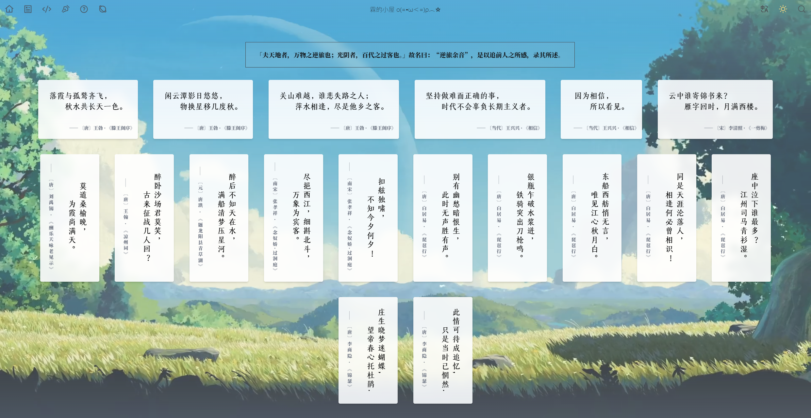
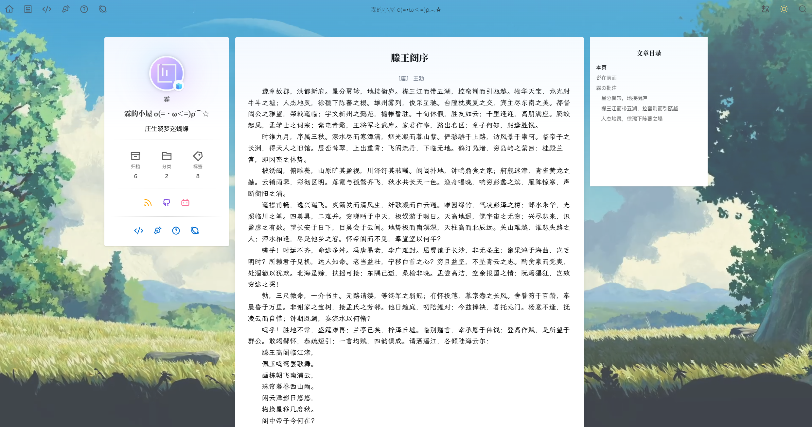

众所周知，若从功利角度，高中阶段的一个积累本对于考场作文是必不可少的；若从文化角度，一个积累集也是陶冶情操的最佳途径。

不知出于哪种原因，或是两者都有，我很早就想做一个属于自己的电子积累集——一是为了方便新增和修改，二是能根据自己的口味随意编排。

于是，怀着“虽然对前端一窍不通，但是能通过学习解决的问题都不是问题”这类想法，笔者试着做了个[【积累集】](https://linium.xin/accumulations)模块(￣▽￣)"

<!-- more -->
## 实现过程

### AccumulationType

首先要明确一个积累集应有的格式：

1. 内容
2. 精华
3. 批注
4. (可选)作者
5. (可选)朝代
6. (可选)出处
7. (可选)国家
8. (可选)横排/竖排

综上，我们就有了这样一个`AccumulationTypes.ts`

```ts
export interface AccumulationItem{
    /**
     * route路径
     */
    path:string
    /**
     * 收集内容
     */
    content: string;
    /**
     * 精华句
     */
    essence?: string[];
    /**
     * 作者
     */
    author ?: string;
    /**
     * 来源
     */
    source ?: string;
    /**
     * 作者所处时代
     */
    period ?: string;
    /**
     * 作者所处地区/国家
     */
    region ?: string;
    /**
     * 文字排列方向（纵向/横向）
     */
    align ?: "horizontal-tb" | "vertical-rl" | "vertical-lr" | "sideways-rl" | "sideways-lr";
    /**
     * 一行/列文字数目限制
     */
    limit ?: number;
    /**
     * 显示顺序（未指定默认随机）
     */
    index ?: number;
    /**
     * 标签
     */
    tags ?: string[];
}
```

### Component

其次是组件部分，我想实现的效果是每个积累都能以卡片形式排布在页面中，并且能通过点击直达对应积累内容（~~因此就直接从`YunProjectCard.vue`里偷过来了~~）

#### Card

很简单地，我们只需要更改`YunProjectCard`中内容的呈现形式即可，修改如下

```vue [LinAccumulationCard.vue]
<script setup lang="ts">
import { AccumulationItem } from './AccumulationTypes';
import {useMotion} from '@vueuse/motion';
import { ref,type CSSProperties,computed} from 'vue';
import AppLink from 'valaxy/client/components/AppLink.vue'
//import LinAccumulationTags from './LinAccumulationTags.vue';

const cubicBezier: Record<string, [number, number, number, number]> = {
  /**
   * 慢速开始，然后加速
   */
  easeIn: [0.18, 0.66, 0.05, 0.96],
  /**
   * 慢速开始和结束
   */
  easeInOut: [0.77, 0, 0.17, 1.02],
}

const props = defineProps<{
    i:number,
    accumulation: AccumulationItem,
    color?:string
}>();

const cardRef = ref<HTMLElement>()
useMotion(cardRef, {
  initial: {
    opacity: 0,
    y: 50,
  },
  enter: {
    opacity: 1,
    y: 0,
    transition: {
      delay: props.i * 50,
      type: 'spring',
      ease: cubicBezier.easeIn,
      damping: 8,
      duration: 400,
    },
  },
})
const cardStyle = computed(() => {
  const styles: CSSProperties={
    writingMode: props.accumulation.align,
  }
  styles.backgroundColor = 'rgba(255,255,255,0.9)'
  if (!styles.color)
    styles.color = 'black'
  if(!props.accumulation.align){
    styles.writingMode = 'vertical-rl'
    styles.letterSpacing = '0.2em'
  }else{
    styles.writingMode = props.accumulation.align
  }
  return styles;
})

//.replaceAll('|','<br/>&#12288&#12288')

const contents = computed(() => {
  if(!props.accumulation.essence){
    var content_:string
    content_ = props.accumulation.content.replaceAll('|','<br/>&#12288&#12288')
    return [content_]
  }else{
    var content_list:string[] = []
    for(let i=0;i<props.accumulation.essence.length;i++){
      content_list.push(props.accumulation.essence[i].replaceAll('|','<br/>&#12288&#12288'))
    }
    return content_list
  }
})
</script>

<template>
  <div v-for="content in contents" class="flex">
    <div
     ref="cardRef"
      flex="~ col center"
      display="inline-grid"
      class="m-5 rounded shadow-md p-2 accumulation-card"
      hover="shadow-lg"
      :style="cardStyle"
    >
      <AppLink :to="props.accumulation.path">
        <div herf="content" class="m-5 text-xl accumulation-content" v-html="content"/>
      </AppLink>
      <div v-if="props.accumulation.author" class="m-3 text-xs text-gray-500 w-full text-right accumulation-author">
        —— <span v-if="props.accumulation.period">〔{{props.accumulation.period}}〕</span>{{ props.accumulation.author }}
          <span v-if="props.accumulation.source"> · {{ props.accumulation.source }}</span>
      </div>
    </div>
  </div>
</template>

<style lang="scss" scoped>
.accumulation-card{
  backdrop-filter: blur(var(--lin-bg-blur));
}

.accumulation-content{
  font-family: 'STDongGuanTi';
  font-weight: normal;
  color: rgb(0, 0, 0)
}

.accumulation-author{
  font-family: 'Noto Serif SC', serif;
}
</style>
```

这里采用了[上图东观体](https://fonts.zeoseven.com/items/488/)，非常适合古文排版，推荐一下~(o゜▽゜)o☆

#### 总览

此外，accumulation界面的渲染也需要通过vue组件来实现，我需要的效果有

1. 能够置顶
2. 能够随机排序

实现上述功能只需在读取accumulation文件夹下`.md`文件时进行`array.sort()`即可

读取`accumulation/*.md`的方法是先通过ValaxyAPI的`UsePageList()`函数获得所有页面的route，再通过筛选含有`/accumulation`的路径实现的。

```vue [LinAccumulations.vue]
<script setup lang="ts">
import { useFrontmatter, usePageList } from 'valaxy';
import { AccumulationItem } from './AccumulationTypes';
import { ref,computed} from 'vue';
import LinAccumulationCard from './LinAccumulationCard.vue';

/**
 * 获取所有AccumulationItem的列表
 */
function useAccumulationList(params: {
  type?: string
} = {}) {
  const pageList = usePageList()
  return computed(() => {
    const routes = pageList.value
      .filter(i =>
        i.path?.startsWith('/accumulations')
        && !(i.path === '/accumulations')
        && !i.path?.endsWith('.html')
        && i.date
        && (!params.type || i.type === params.type)
        && (!i.hide || i.hide === 'index'),
      )

    // 按index排序
    const topAccmulations = routes.filter(i => i.index).sort((a,b) =>  (b.index??0)-(a.index??0) )
    const otherAccumulations = routes.filter(i => !i.index).sort(() => Math.random()-0.5)

    return topAccmulations.concat(otherAccumulations)
  })
}

const fm = useFrontmatter();

const notice = ref(fm.value.notice);

const accumulations = useAccumulationList().value as AccumulationItem[]
</script>

<template>
    <div class="w-full px-4 flex-center m-3">
      <div class="yun-notice w-full">
        <span v-html="notice" />
        <slot />
      </div>
    </div>
    <div class="flex justify-center flex-wrap flex-1">
        <LinAccumulationCard v-for="accu,i in accumulations" :accumulation="accu" :i="i" class="flex"/>
    </div>
</template>

<style lang="scss" scoped>

.yun-notice {
  border: 1px solid var(--va-c-text);
  display: flex;
  flex-direction: column;
  justify-content: center;
  align-items: center;
  font-family: var(--va-font-serif);
  font-weight: bold;
  padding: 1rem;
  max-width: var(--yun-post-card-max-width);
  background-color: rgba(201, 201, 201, 0.1);
  backdrop-filter: blur(var(--lin-bg-blur));
}
</style>
```

#### 积累内容

当点开一个积累时，我希望能将内容自动呈现在标题之下，这需要通过`layout`实现，但在此之前需要先将需要展示的内容及格式写成vue组件，方便后续调用。

只需将内容按指定字体及行距展示即可，同样简单。

```vue [LinAccumulationMeta.vue]
<script setup lang="ts">
import { AccumulationItem } from './AccumulationTypes';

const fm = defineProps<{
    accumulation:AccumulationItem
}>()

const content = (fm.accumulation.content??"").replaceAll('|','<br/>').replaceAll(')','&#12288&#12288')

const author = fm.accumulation.author
const period = fm.accumulation.period

</script>

<template>
    <div class="inline-flex-center gap-1 m-2">
        <span class="text-sm text-gray-500">〔{{period}}〕</span>
        <span class="text-sm text-gray-500">{{ author }}</span>
    </div>
    <div 
        class="inline-flex-center text-lg accumulation-content leading-relaxed mx-8 text-black dark:text-white" 
        v-html="content"
    />
</template>

<style lang="scss" scoped>
.accumulation-content{
  font-family: "LXGW WenKai";
  font-weight: normal;
}
</style>
```

### Layout

如果我们想让Valaxy在一个积累中自动将内容展示出来，就需要给对应的文章设置`accumulation`的layout

这里我们直接从`yun`主题的post layout中 ~~偷(划掉)~~ 窃^[读书人的事怎么能叫偷呢？]过来一些并简单修改一下，将LinAccumulationMeta插入在正文之前即可。

```vue [accumulation.vue]
<script lang="ts" setup>
import type { Article } from '@unhead/schema-org'
import { defineArticle, useSchemaOrg } from '@unhead/schema-org/vue'
import { toDate } from 'date-fns'
import { useFrontmatter, useFullUrl, useSiteConfig } from 'valaxy'
import { computed } from 'vue'
import { AccumulationItem } from '~/components/accumulations/AccumulationTypes'
import LinAccumulationMeta from '~/components/accumulations/LinAccumulationMeta.vue'

const siteConfig = useSiteConfig()
const frontmatter = useFrontmatter()
const url = useFullUrl()

const showSponsor = computed(() => {
  if (typeof frontmatter.value.sponsor === 'boolean')
    return frontmatter.value.sponsor

  return siteConfig.value.sponsor.enable
})

const article: Article = {
  '@type': 'BlogPosting',
  'headline': frontmatter.value.title,
  'description': frontmatter.value.description,
  'author': [
    {
      name: siteConfig.value.author.name,
      url: siteConfig.value.author.link,
    },
  ],
  'datePublished': toDate(frontmatter.value.date || ''),
  'dateModified': toDate(frontmatter.value.updated || ''),
}

const image = frontmatter.value.image || frontmatter.value.cover
if (image)
  article.image = image

useSchemaOrg(
  defineArticle(article),
)


</script>

<template>
  <YunLayoutWrapper>
    <YunLayoutLeft />

    <RouterView v-slot="{ Component }">
      <component :is="Component">
        <template #main-header-after>
          <LinAccumulationMeta :accumulation="frontmatter as AccumulationItem"/>
        </template>

        <template #main-content-after>
          <YunSponsor v-if="showSponsor" m="t-6" />
          <ValaxyCopyright v-if="frontmatter.copyright || (frontmatter.copyright !== false && siteConfig.license.enabled)" :url="url" m="y-4" />
        </template>

        <template #aside-custom>
          <slot name="aside-custom" />
        </template>
      </component>
    </RouterView>

    <YunLayoutRight />
  </YunLayoutWrapper>
  <YunFooter/>
</template>
```

::: warning

在`Valaxy@v0.23.x`中，`unhead`的引用方式由`from "@unhead/schema-org"`更改为`from "@unhead/schema-org/vue"`，困扰笔者三天之久╰(艹皿艹 )

:::

## 成品展示





本文叙述可能并不详尽，等回来有空了再补补（

咕咕咕（
