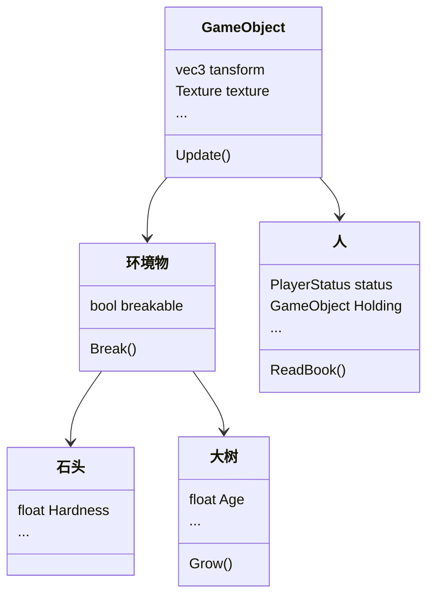
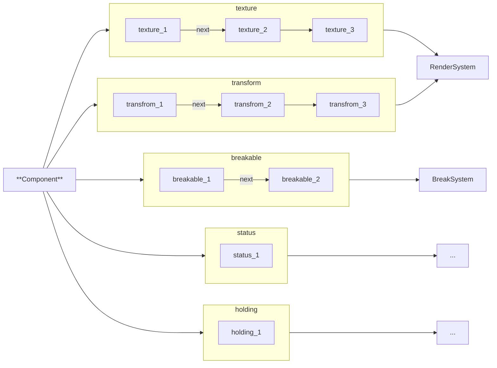
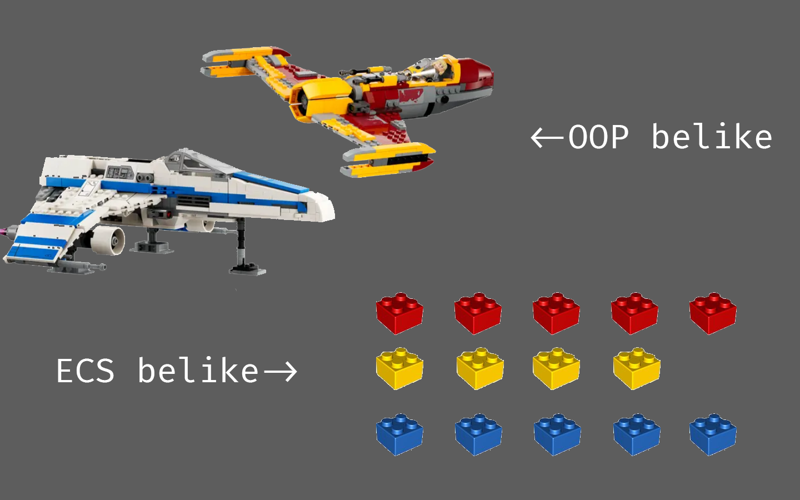
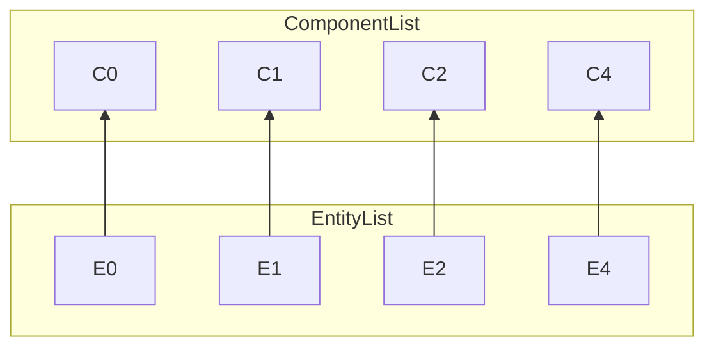

## 系列介绍

本系列是读[ECS深入浅出——EnTT作者skypjack](https://skypjack.github.io/)系列的笔记，并在C#中从头实现一遍，因此会包含较多的个人理解，如有疏漏，还望各位批评指正 ο(=•ω＜=)ρ⌒☆

本系列将以一章理论(**Th**eory)，一章实践(**Pr**acticle)的节奏更新，实践章中一般会包含在实现过程中踩的坑与具体步骤。偶尔会在其中插入一章进阶(**Ex**tra)，即较难理解的技巧向章节。

本章主要讲了ECS的理论基础
[[toc]]

<!-- more -->

## 何为ECS？

### ECS与OOP的区别

要弄清楚ECS是什么，不妨先明白它与传统架构**OOP**的差异。先来想象一个游戏场景：

>在你面前有一块石头，一棵大树和在树荫下读书的一个人

那么，在ECS和OOP中，这个场景都将如何拆解呢？这里就可以引出两种拆解方式：**水平分割**与**竖直分割**

在传统的OOP架构中，拆解后的结构看起来像是这样的：



不难看出，OOP看起来像是把每个游戏对象竖直分隔开，成为独立的个体，并依赖继承关系来实现代码复用，也就是常说的类，每个`GameObject`(下文缩写为`GO`)都有自己独立的属性，彼此独立。

但，当GO间的继承关系变得复杂时，其本符合生活习惯的思维方式反而会变成一种障碍，各种复杂的多重继承更是令人脑袋晕晕。

那么，ECS的**水平分割**看起来又是什么样的呢？



可见，在ECS中，并没有很清晰的“`GO`”概念，取而代之的是一个个`Component`。不同的逻辑由相应组件的`System`实现，互不干扰，降低了耦合性。

>换句话讲，OOP中，描述物体的方式是“这个物体**是什么**”，而在ECS中，描述物体的方式是**有什么**，是进一步的抽象。

在这种实现方式下，不同的`GO`之间的界限被抹除，只留下紧密排列的Component，System也不需要关心自己到底在操作哪个"对象"，而只需要关注眼前的数据就好了，既不用引入无关数据，也不会干扰其他系统，可谓一举两得。

### 为何ECS？

ECS带来的最大便利，就是极致的**速度**

试想一下，如果你面前摆放着一些已完成的“乐高作品”，现在，要求你**把所有的黄色2x2砖块**都做上某种标记，这无疑是困难且不可能完成的。

但是如果是一些独立且排列整齐的积木块呢？在这种情况下，**找出所有**黄色积木块就非常简单了，只需要找出黄色积木块所在的组，依次标记就好啦 (o゜▽゜)o☆（如图）



乐高成品对应的即是OOP模式中的`GO`，以单个对象为单位，整体操作；而散落排布的积木块即是ECS中的`Component`，以单个组件为单位，精确而高效。

虽然传统的OOP在绝大多数情况下都**没什么大问题**，依旧正常运转，但是当加载的GO数量极大时，性能开销与缓存未命中也将指数爆炸。

这时，天空一声巨响，ECS闪亮登场，其准确简洁的数据结构几乎是为这种场景量身定制，**效率提升**十分显著。

>不过，在绝大多数场景中，ECS与OOP的表现**并没有明显区别**。我们在ECS中获得的最大便利实际上是一种编程范式，或者说**让代码更好维护的编程思维**。

总之，再怎么说，学学ECS总是没什么坏处的嘛 ~(￣▽￣)~*

## 万丈高楼平地起

### 从OOP到ECS

万事开头难，不妨先试试一种不那么激进的方式——让GO成为Component的承载者，而不是数据与方法的承载者，示例如下：

```csharp
abstract class GameObject
{
    /// 实体Id
    int Id { set; get; }
    /// 实体所承载的Components
    List<Component> Components { set; get; } = [];
    /// Component的类型，无序，用于加速判断
    HashSet<Type> ComponentTypes { set; get; } = [];
    /// 获取T类型的Component(示例)
    Component? GetComponent<T>()
    {
    return Components.Find(c => c.GetType() is T);
    }
    bool Has<T>()
    {
    return ComponentTypes.Contains(typeof(T));
    }
}
```

而当我们想操作Component时，System可以像这样写:

```csharp
void MySystem(List<GameObject> objects){
    foreach(GameObject obj in objects){
        if(obj.Has<MyComponent>()){
            component = obj.GetComponent<MyComponent>();
            // 干点啥 ¯\_(ツ)_/¯
        }
    }
}
```

这种方法对于习惯OOP的人来说很容易接受，写起来也很舒服，且易于维护，但基本没有解决OOP的痛点，还可能导致更多性能问题。总而言之，这种方法只是一个由OOP到ECS过渡态的“杂交版”，只能起到思维上的过渡，并**不推荐**实际应用。

### 对象补完计划

接下来，我们所要做的就是**彻底消灭GO**，取而代之，我们将称呼“石头”“大树”“人”这一类东西为`Entity`。

具体实现这一目的的方法，便是**视Entity为Index**，消灭GO之间的界限，只把实体看作对Component的索引，就已经足矣，我愿称之为「**對象補完計画**」（什）

化GO为Entity后，具体实现应该像这样：

```csharp
namespace Entity{
    public struct Entity(int id)
    {
    // 其实Entity还应有version属性来实现复用
    // version的实现会在后面的章节完成
    int Id { get; } = id;
    }
}
```

没错，正如你所见，一个纯粹的Index。Entity仅仅作为Component的Index，而不含任何功能，所有Entity的属性都别无二致。

那么，不同的Component是如何绑定到Entity身上的呢？



如图，Entity和Component都以一定的顺序排列的数组中，Entity永远位于第`Id`项，Component同理，该种数组能使Entity与Component相互链接；而不同组件的数组又由不同组件的System掌管，如此，任意$N$种Component，$M$个Entity，都可以通过$2N$个长度为$M$的数组实现将Entity作为Index访问Component。优雅而高效~

这就是另一个C++ ECS框架——entityx的实现方式，而EnTT的实现方式我们将在TH2中详细介绍。

同样地，管理Entity与Components之间关系的模块，我称之为Context，这部分我们会在[PR1-Context](https://linium.xin/posts/ECS-PR1初识#Context（Component-Entity的对应关系）)中详细讲解

至此，我们已经初步理解了ECS的概念，正式踏上了追求高效与优雅的旅途。

## 接下来？

下一章TH2: Entity放在哪——SparseSet 稀疏集
其实PR1的内容在这章已经展示的差不多了，PR1需要做的主要就是汇总并完善一下各种示例（

ECS-TH1初识，结束~ο(=•ω＜=)ρ⌒☆
