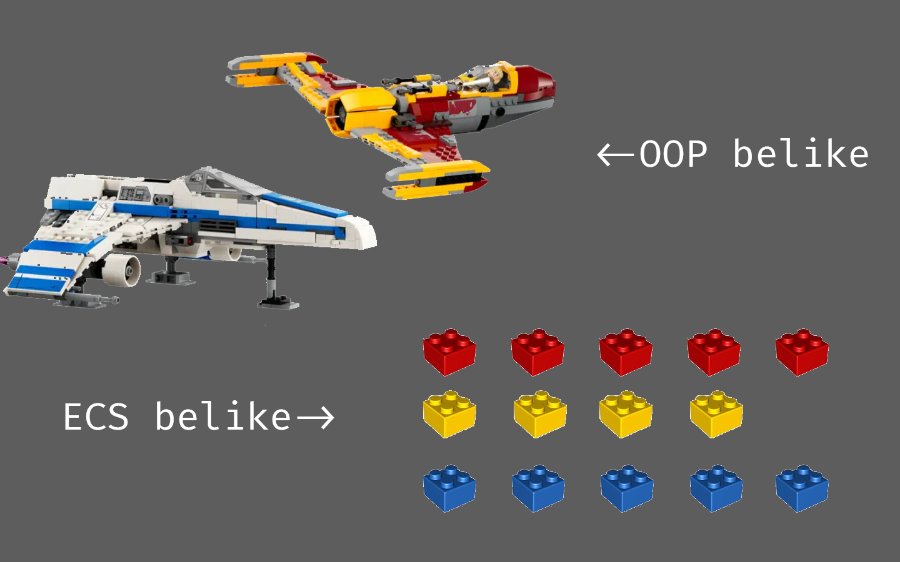

## 系列介绍

本系列是读[ECS深入浅出——EnTT作者skypjack](https://skypjack.github.io/)系列的笔记，旨在给自己讲清楚ECS具体是怎么一回事，并在C#中从头实现一遍,因此会包含较多的个人理解，如有疏漏，还望各位批评指出 ο(=•ω＜=)ρ⌒☆

本系列将以一章理论(**Th**eory)，一章实践(**Pr**acticle)的节奏更新，实践章中一般会包含在实现过程中踩的坑与具体步骤。偶尔会在其中插入一章进阶(**Ex**tra)，即较难理解的技巧向章节。

## 本章目录

1. 什么是ECS
    1. ECS与OOP的区别
    2. 为什么要用ECS？
2. 万丈高楼平地起
	1. 由OOP到ECS
	2. GO补完计划
	3. ComponentId

<!-- more -->

## 什么是ECS？

### ECS与OOP的区别

要弄清楚ECS是什么，不妨先明白它与传统架构**OOP**的差异。先来想象一个游戏场景：
:::info
在你面前有一块石头，一棵大树和在树荫下读书的一个人
:::

那么，在ECS和OOP中，这个场景都将如何拆解呢？这里就可以引出两种拆解方式：**水平分割**与**竖直分割**

在传统的OOP架构中，拆解后的结构看起来像是这样的：

不难看出，OOP看起来像是把每个游戏对象竖直分隔开，成为独立的个体，也就是常说的类，每个`GameObject`(下文缩写为`GO`)都有自己独立的属性，互不干扰。

而在ECS的水平分割中，看起来应该是这样的：

可见，在ECS中，并没有很清晰的“`GO`”概念，取而代之的是一个个`Component`。不同的逻辑由相应组件的`System`实现，互不干扰，降低了耦合性。

在这种实现方式下，不同的`GO`之间的界限被抹除(~~GO补完计划~~)，只留下紧密排列的`Component`，`System`也不需要关心自己到底在操作哪个"对象"，而只需要关注眼前的数据就好了，既不用引入无关数据，也不会干扰其他系统，可谓一举两得~ ♪(´▽｀)

从OOP的“按对象排列”思想转换为ECS中的“按数据排列”，便是开启ECS的第一步。

### 为什么要用ECS？

ECS带来的便利之一，就是**遍历**时的优雅。

试想一下，如果你面前摆放着一些已完成的“乐高作品”，现在，要求你**把所有的黄色2x2砖块**都做上某种标记，这无疑是困难且不可能完成的 (￣▽￣)"

但是如果是一些独立且排列整齐的积木块呢？在这种情况下，**找出所有**黄色积木块就非常简单了，只需要找出黄色积木块所在的组，依次标记就好啦 (o゜▽゜)o☆（如图）

