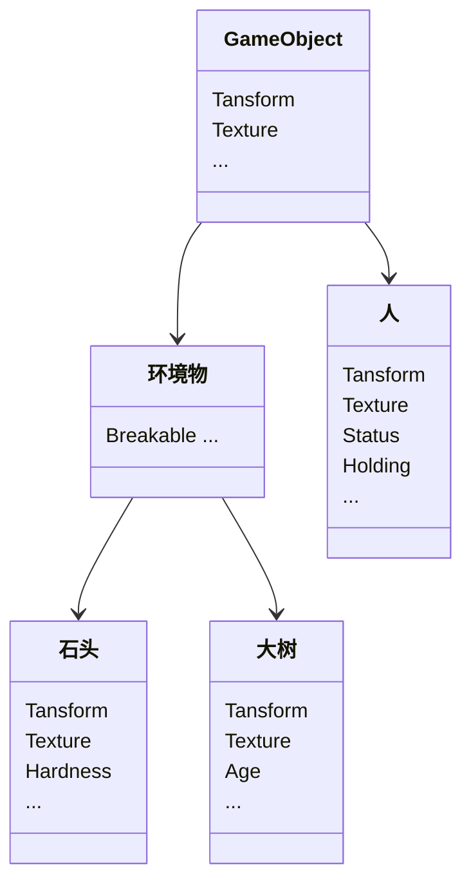

## 系列介绍

本系列是读[ECS深入浅出——EnTT作者](https://skypjack.github.io/)系列的笔记，旨在给自己讲清楚ECS具体是怎么一回事，并在C#中从头实现一遍,因此会包含较多的个人理解，如有疏漏，还望各位批评指出 ο(=•ω＜=)ρ⌒☆

本系列将以一章理论(**Th**eory)，一章实践(**Pr**acticle)的节奏更新，实践章中一般会包含在实现过程中踩的坑与具体步骤。偶尔会在其中插入一章进阶(**Ex**tra)，即较难理解的技巧向章节。

## 什么是ECS？

要弄清楚ECS是什么，首先明白它与传统架构**OOP**的差异！不妨先构造一个场景：

:::info
在你面前有一块石头，一棵大树和在树荫下读书的一个人
:::

那么，在ECS和OOP中，这个场景都将如何拆解呢？这里就可以引出两种拆解方式：**水平分割**与**竖直分割**

在传统的OOP架构中，拆解后的结构看起来是这样的：

