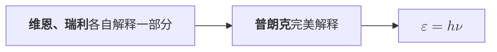
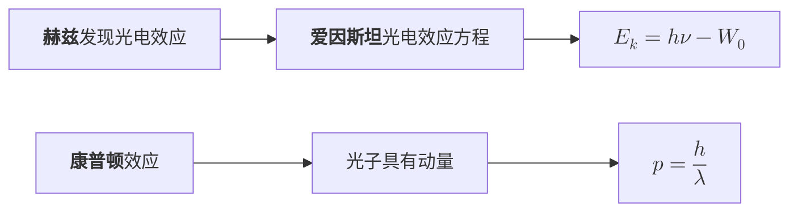
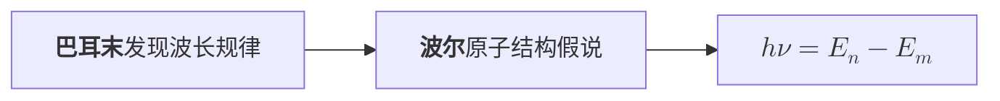

原子物理实为人类群星闪耀之时——如果不考物理学史的话¯\\\_(ツ)_/¯

<!-- more -->

## 波粒二象性

### 黑体辐射

黑体指不反射电磁波但只能向外发射电磁波的物体，黑体辐射由于冶金业的发展而备受关注。

1869年，德物理学家**维恩**提出的公式在短波区与实际贴合；1900年，英物理学家**瑞利**提出的公式在长波区与实际贴合，但都无法全部解释。

最终，1900年，普朗克将**能量子** $\varepsilon$ 的概念引入，完美诠释了黑体辐射，获得了1918年诺贝尔奖。

$$\fcolorbox{#f35c69}{null}{$\varepsilon = h\nu$}$$

其中的 $h$ 为普朗克常量，其值为

$$h=6.62607015\times10^{-34} \space \rm J\cdot s$$

### 光的粒子性

#### 光电效应

1887年，**赫兹**在研究电磁波的过程中偶然注意到了光电效应，后续被许多物理学家证实。

1905年，基于普朗克量子假说，**爱因斯坦**提出了**光子**的概念，并提出了爱因斯坦光电效应方程。

$$\fcolorbox{#f35c69}{null}{$E_k = h\nu - W_0$}$$

其中 $E_k$ 为光电子的最大动能

$$E_k = \frac{1}{2}m_e{v_e}^2=eU_c$$

#### 康普顿效应

1918~1922年，美物理学家康普顿发现X射线与电子碰撞会发生散射，提出“光子具有动量”，获得了1927年诺贝尔奖。

$$\fcolorbox{#f35c69}{null}{$p=\dfrac{h}{\lambda}$}$$

### 物质波

1924年，**德布罗意**提出假设：实物粒子也具有波动性，且遵循以下规律：

$$\nu=\dfrac{\varepsilon}{h},\space \lambda=\dfrac{h}{p}$$

这种与实物粒子联系起来的波叫做**德布罗意波**，也叫**物质波**

1927年，**G.P.汤姆逊**和**戴维森**验证了电子的波动性，证实了德布罗意波的存在

## 原子的核式结构

### 电子的发现

1897年，**J.J.汤姆逊**根据阴极射线在电磁场中的偏转确定，该射线是一种带电微粒，命名为**电子**，这说明了原子具有结构

1909~1913年间，**密立根**通过“油滴实验”精确测量了电子电荷 $e$ 的数值。

$$e\approx1.602176634\times 10^{-19}\space \rm C$$

### 原子的核式结构模型

J.J.汤姆逊发现电子后，在1898年提出了枣糕模型，但很快被质疑。

1909年，**卢瑟福**进行了 $\alpha$ 粒子散射实验，彻底否定了枣糕模型，1911年，卢瑟福提出了**核式结构模型**，和实验数据符合很好。

## 原子光谱

1885年，瑞士物理学家巴耳末发现氢原子光谱波长符合一个简单的公式。

$$\dfrac{1}{\lambda}=R_{\infin}\left(\dfrac{1}{2^2}-\dfrac{1}{n^2}\right),\space n=3,4,5,\cdots$$

其中 $R_{\infin}$ 成为**里德伯**常量，实验测得值为 $R_{\infin}=1.10\times 10^7 \space \rm m^{-1}$，该公式称为巴耳末公式。

1913年，**波尔**注意到经典理论在解释光谱方面的困难，提出了轨道量子化的理论

即 当电子从较高能级 $E_n$ 跃迁到较低能级 $E_m$ 时，会放出能量为 $h\nu$ 的光子。

$$\fcolorbox{#f35c69}{null}{$h\nu = E_n-E_m$}$$

## 原子核

### 天然放射

1896年，法物理学家**贝克勒尔**发现铀的天然放射性

受到其发现的影响，**居里夫妇**发现了钋 $\rm Po$ 和镭 $\rm Ra$

后续，物理学家通过多方面的研究，确定了 $\alpha$ 射线是氦核，穿透力较弱；$\beta$ 射线是电子，穿透能力强；$\gamma$ 射线是光子，穿透能力非常强。

### 原子核组成

1919年，**卢瑟福**通过 $\alpha$ 粒子轰击 $\rm {}^{14}_7N$，发现了**质子**，后续其学生**查德威克**轰击 $\rm {}^9_4Be$ 发现了**中子**。

$$\rm {}^4_2He + {}^{14}_7N \longrightarrow {}^{17}_8O + {}^1_1H$$

---

以上就是高中物理选必三中涉及物理学史的全部内容啦。(o゜▽゜)o☆

> “在这里，我想从极其不同的时代和地区回顾群星照耀的某些时刻
>
> 我这样称呼那些时刻，是因为它们宛若星辰一般永远散射着光辉，普照着暂时的黑夜。”
>
> ——《人类群星闪耀时》

