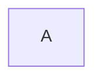
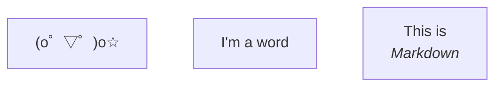
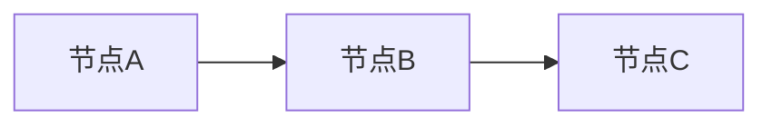
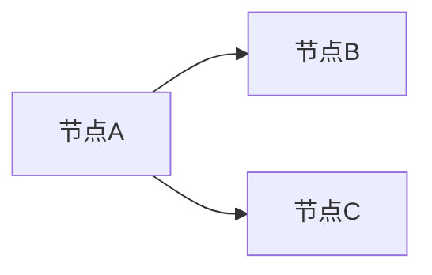
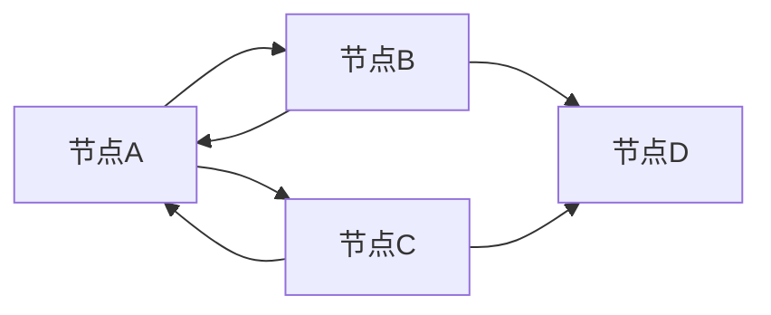
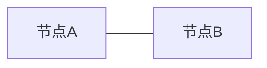
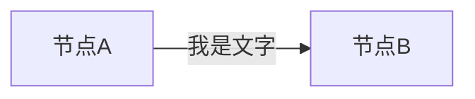
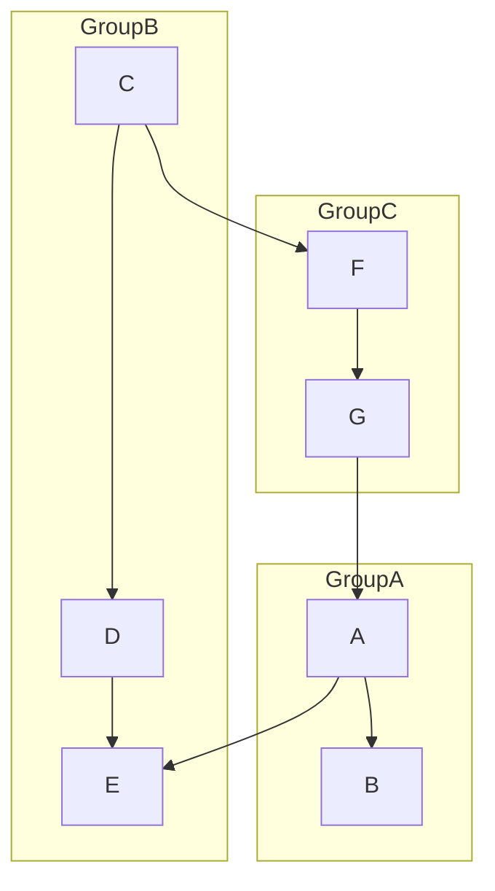
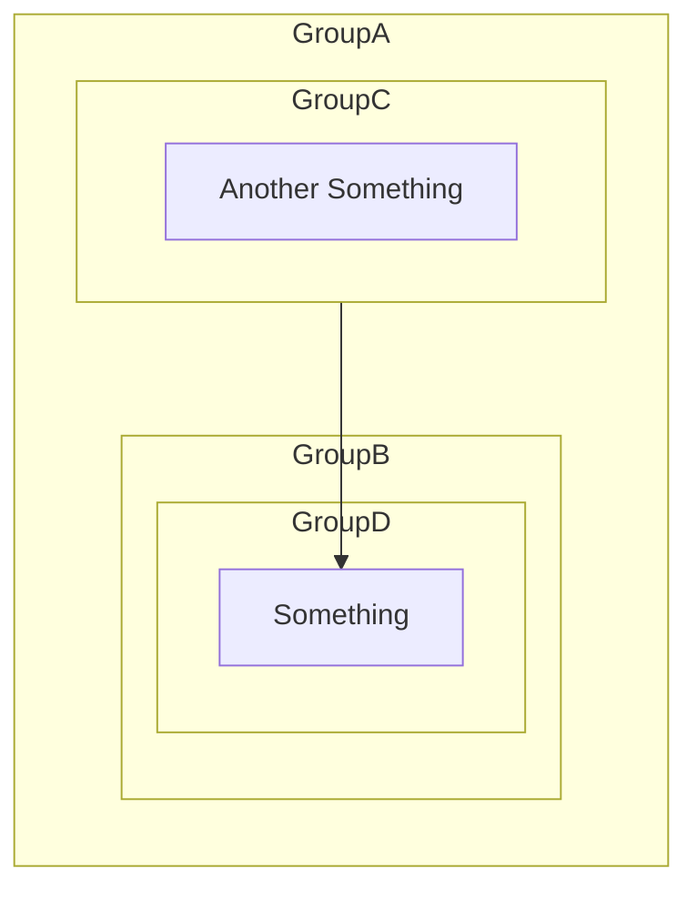

本文是Mermaid基础功能教程，其实主要是因为一鸽鸽太久想不起来Mermaid怎么写，所以给自己建个备忘录（

<!-- more -->

## 基础语法

### 流程图

#### 节点

```markdown
flowchart LR
    A
```



#### 带字的节点

```markdown
flowchart TD
    A["(o゜▽゜)o☆"]
    B[I'm a word]
    C["` This is 
    *Markdown* `"]
```



> 注意：当文字内含有除字母外时，需要使用`"text"`  
> 而当文字内含有Markdown内容时，需要使用"\`text`"

#### 连接

顺序

```markdown
flowchart LR
    A[节点A]
    B[节点B]
    C[节点C]
    A --> B --> C
```



分叉

```markdown
flowchart LR
    A[节点A]
    B[节点B]
    C[节点C]
    A --> B && C
```



更加复杂...

```markdown
flowchart LR
    A[节点A]
    B[节点B]
    C[节点C]
    D[节点D]
    A --> B & C --> A & D
```



不带箭头

```markdown
flowchart LR
    A[节点A]
    B[节点B]
    A --- B
```



带文字

```markdown
flowchart LR
    A[节点A]
    B[节点B]
    A --我是文字-> B
```

或者

```markdown
flowchart LR
    A[节点A]
    B[节点B]
    A -->|我是文字| B
```



#### 顺序

|顺序      |代码    |
|----------|--------|
|由上至下 ↓|TD 或 TB|
|由下至上 ↑|BT      |
|从左往右 →|LR      |
|从右往左 ←|RL      |

### 子图

基本语法

```markdown
graph TD
    subgraph GroupA
    direction LR
        A --> B
    end

    subgraph GroupB
    direction TB
        C --> D --> E
    end

    subgraph GroupC
    direction TB
        F --> G
    end
    C --> F
    G --> A
    A --> E
```



套娃



## 结语

以上基本足够平时写blog使用了，等后续有需要再加 =w=
