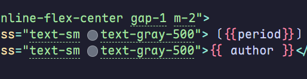

想给博客加点花哨东西，但是笔者对前端一窍不通，是故去学TailwindCSS力（

本篇只是笔者学习TailwindCSS时的一点小笔记，汇总了一些个人觉得较为重要的概念，并不详尽。

若要系统学习Tailwind，请移步[tailwindcss官网](https://tailwind.org.cn/docs/styling-with-utility-classes)

<!-- more -->

## TailwindCSS是什么？

*CSS*想必读者并不陌生，但有过前端开发经验的人大概率经历过被*冗杂*且*复杂*的CSS绕的头晕眼花的时刻。

暂且不论这样复杂的系统故障率有多高，光是编写HTML和CSS时的**割裂**体验就足够让人恼火——那么如何让网页的构建变得流畅简单？

> 只需书写 HTML 代码，无需书写 CSS，即可快速构建美观的网站。

这便是TailWind官网上给出的解决方案，TailWind框架通过包含如`pt-4`、`flex`、`text-center`等工具集，使得我们可以直接在HTML元素的`class`中实现我们需要的样式。

多说无益，不如亮出一段分别在有无Tailwind的情境下编写的网页代码：

::: code-group

```html [有Tailwind]
<div class="abusolute w-full h-full bg-black">
    <div 
    class="flex abusolute w-full h-full justify-center items-center font-mono text-5xl text-white"
    >
        ✨Hello World!
    </div>
</div>
```

```html [无Tailwind]
<div class="background">
    <div 
    class="greeting"
    >
        <div class="greeting-text">
        ✨Hello World!
        </div>
    </div>
</div>
<style>

.background{
    position: abusolute;
    width: 100%;
    height: 100%;
    background-color: rgb(0 0 0);
}

.greeting {
    justify-content: center;
    align-items: center;
}

.greeting-text{
    font-family: "Fira code";
    font-size: 2rem;
    font-weight: bold;
     color: white;
}

* {
    margin: 0;
    padding: 0;
}
</style>
```

:::

<CodePen class="h-300px" name="HelloWorld" id="wBvXzwO" user="xiao-dreamr" tab="html,result" />

## 环境搭建

本文是在`Valaxy`框架下修改博客时写成的，故下文都将默认为`Valaxy`环境下

### VScode 插件

推荐使用[UnoCss](https://marketplace.visualstudio.com/items?itemName=antfu.unocss)插件

启用插件需要当前根目录下存在`unocss.config.ts`文件，该文件默认配置如下即可

```ts
import {
    defineConfig,
    presetAttributify,
    presetIcons,
    presetTypography,
    presetUno,
    presetWebFonts,
    transformerDirectives,
    transformerVariantGroup
  } from 'unocss'
  
export default defineConfig({
    shortcuts: [
        // ...
    ],
    theme: {
        colors: {
        // ...
        }
    },
    presets: [
        presetUno(),
        presetAttributify(),
        presetIcons(),
        presetTypography(),
        presetWebFonts({
        fonts: {
            // ...
        },
        }),
    ],
    transformers: [
        transformerDirectives(),
        transformerVariantGroup(),
    ],
})
```

当你在配置后看到如



的虚线时，就代表配置成功

## 语法

### 预设类

`UnoCss`允许我们在`Valaxy`框架下使用`TailWind CSS`，并内置了同款预设。

此外，由于Valaxy内置了`Attributify preset`，所以我们可以不用将所有属性都挤在一个class中，而可以根据属性类别分开写，比如

::: code-group

```html [有Attributify]
<div position="absolute" bg="black" class="w-full h-full">
    <div 
    flex
    position="absolute"
    class="w-full h-full justify-center items-center font-mono"
    text="5xl white"
    >
        ✨Hello World!
    </div>
</div>
```

```html [无Attributify]
<div class="abusolute w-full h-full bg-black">
    <div 
    class="flex abusolute w-full h-full justify-center items-center font-mono text-5xl text-white"
    >
        ✨Hello World!
    </div>
</div>
```

:::

这种写法见仁见智，只要挑选自己写起来顺手舒服，可读性好的就好啦~(￣▽￣)"

使用时，只需在html元素的class中添加对应预设即可

### 非预设情况

预设的属性并不一定能满足我们的所有需求，于是我们可以对预设进行调整。

比如我们觉得`text-5xl`还是太小时，我们可以通过`[]`将所需的数值括起来，替换`5xl`，就像`text-[10rem]`，这样我们就能以TailWind的风格自定义属性

### 伪类/元素选择器

当我们需要编写`:hover`，`:dark`等伪类CSS时，Tailwind如何实现？

非常简单，只需在对应的属性前添加`伪类名:`即可，如`hover:bg-blue`，`before:bg-pink-500`。

当然，多个选择器可以相互叠加，如`hover:dark:bg-sky-500`。

```html
<blockquote class="text-center text-2xl font-semibold text-gray-900 italic dark:text-white">
  When you look
  <span class="relative inline-block before:absolute before:-inset-1 before:block before:-skew-y-3 before:bg-pink-500">
    <span class="relative text-white dark:text-gray-950">annoyed</span>
  </span>
  all the time, people think that you're busy.
</blockquote>
```

<div class="text-center text-2xl font-semibold text-gray-900 italic dark:text-white mt-8 mb-8">
  When you look
  <span class="relative inline-block before:absolute before:-inset-1 before:block before:-skew-y-3 before:bg-pink-500">
    <span class="relative text-white dark:text-gray-950">annoyed</span>
  </span>
  all the time, people think that you're busy.
</div>

示例源[tailwind.org](https://tailwind.org.cn/docs/hover-focus-and-other-states#before-and-after)，不过似乎在文章界面显示不了（汗）

### 响应式变体

当我们想在不同尺寸的设备上实现不同的显示效果时，实现的方式和伪类选择器十分相似，只需在属性前加上`xxx:`即可。

默认存在五种分类，根据常见的设备分辨率设置，如下：

|前缀|最小宽度|
|----|--------|
|`sm` |40 rem  |
|`md` |48 rem  |
|`lg` |64 rem  |
|`xl` |80 rem  |
|`2xl`|96 rem  |

### 颜色相关

我们可以通过`-数字`来调节颜色明暗(50~950)，`/数字`来调节颜色不透明度(0~100)，比如`text-blue-300`，`bg-blue-500/80`

## 常见预设

此处援引[tailwindcss官网](https://tailwind.org.cn/docs/styling-with-utility-classes)，已经相当详尽，使用时按需查阅即可，此处不再过多赘述。
